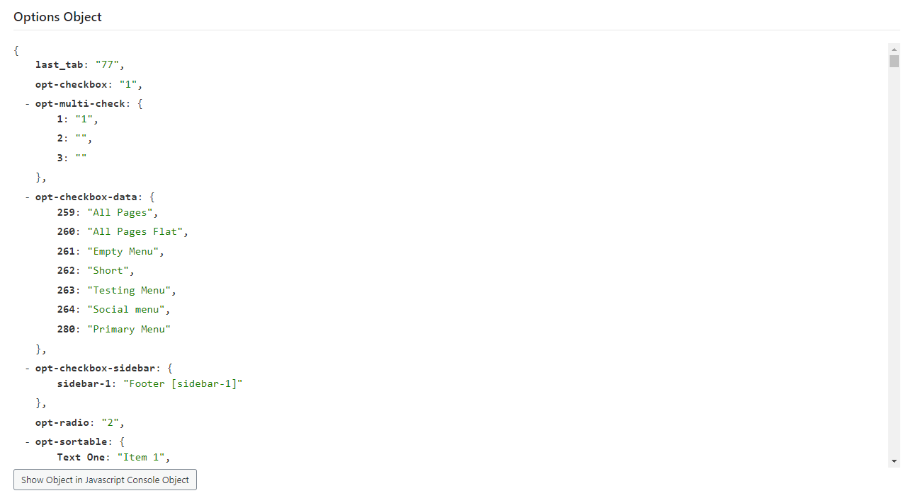
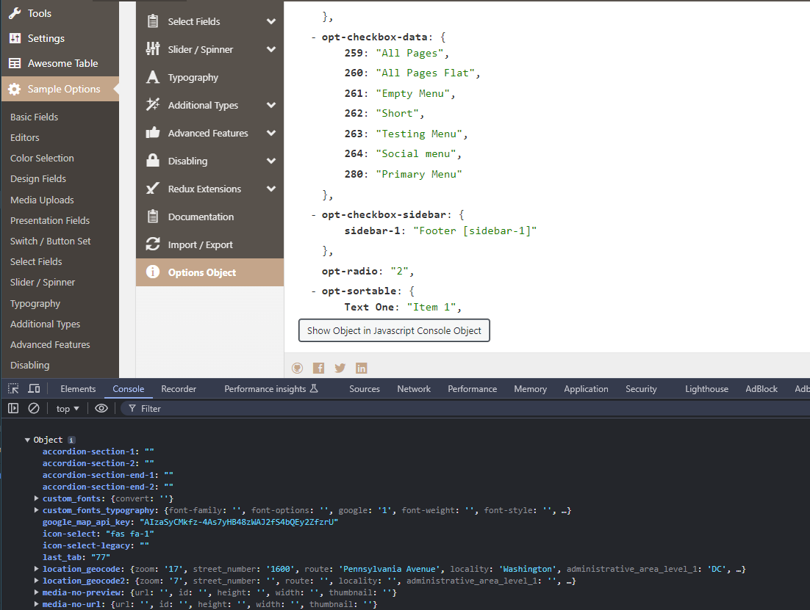

# Options Object <Badge text="field, enhancement" type="warn"/>

The Options Object field is designed to give developers who use Redux a quick glance at 
their option values in a readable JSON string. Ideally, the field/enhancement is for 
develop purposes and doesn't need to be shipped in your final product.

<span style="display:block;text-align:center"></span>

::: warning Table of Contents
[[toc]]
:::

##Usage
This field is not set in the traditional Redux way by adding an option array to your config. 
Instead, it is an argument set in the [global arguments](../configuration/global_arguments.md) array.

The `options_object` is enabled by default and the field will automatically appear on your options screen. 
To disable it, simply add the following line inside the global arguments array:

```php
'options_object' => false,
```
## Console Log
For added conveinence, one may also display the current options object via the developer's 
console log (CTRL+SHIFT+I) by clicking the "Show OPbject in JavaScript Console Object" button.

<span style="display:block;text-align:center"></span>
