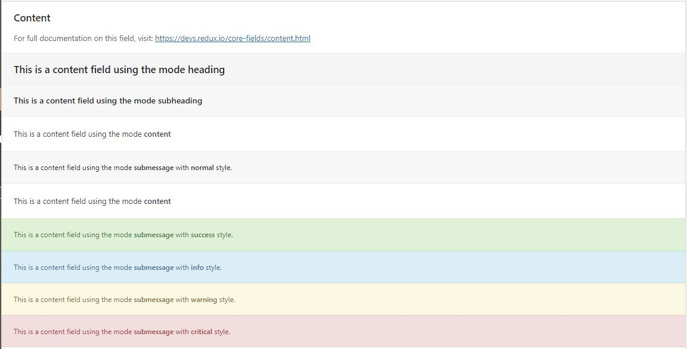

# Content

The Content field comes in several modes to display information as heading, subheading, content, and submessage.

<span style="display:block;text-align:center"></span>

::: warning Table of Contents
[[toc]]
:::

## Arguments
| Name    | Type   | <div style="width:70px;">Default</div> | Description                                                                                                                    |
|---------|--------|----------------------------------------|--------------------------------------------------------------------------------------------------------------------------------|
| type    | string | `content`                              | Value identifying the field type.                                                                                              |
| mode    | string | `content`                              | Sets the mode of the content box.  Accepts: `heading` `subheading` `content` `submessage`                                      |
| content | string |                                        | Text to appear on screen.                                                                                                      |
| icon    | string |                                        | `heading` mode only. Name of an Elusive Icon font (or name of icon from a manually installed set) to use in the heading field. |
| style   | string | `normal`                               | `submessage` mode only. Accepts: `normal`, `success`, `info`, `warning`, `critical`                                            |

::: tip Also See
- [Global Field Arguments](../configuration/fields/arguments.md)
- [Using the `required` Argument](../configuration/fields/required.md)
:::

::: warning Tip
When using the Content field with `required`, the field cannot be hidden by default.  It’s best only to use the `required` argument with this 
field when the fold is shown by default.
:::

## Example Config

#### Heading
```php
Redux::set_field( 
    'OPT_NAME', 
    'SECTION_ID', 
    array(
        'id'      => 'opt-heading-1',
        'type'    => 'content',
        'mode'    => 'heading',
        'content' => 'This is a content field using the mode <strong>heading</strong>',
    ) 
);
```

#### Subheading
```php
Redux::set_field( 
    'OPT_NAME', 
    'SECTION_ID', 
    array(
        'id'      => 'opt-subheading-1',
        'type'    => 'content',
        'mode'    => 'subheading',
        'content' => 'This is a content field using the mode <strong>subheading</strong>',
    ) 
);
```

#### Content
```php
Redux::set_field( 
    'OPT_NAME', 
    'SECTION_ID', 
    array(
        'id'      => 'opt-content-1',
        'type'    => 'content',
        'mode'    => 'content',
        'content' => 'This is a content field using the mode <strong>content</strong>',
    ) 
);
```

#### Submessage
```php
Redux::set_field( 
    'OPT_NAME', 
    'SECTION_ID', 
    array(
        'id'      => 'opt-submessage-2',
        'type'    => 'content',
        'mode'    => 'submessage',
        'content' => 'This is a content field using the mode <strong>submessage</strong> with <strong>success</strong> style.',
        'style'   => 'success',
    ) 
);
```
